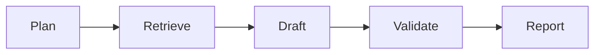

# About Section Writer Agent

Purpose: Generate section-specific About content (hero, credentials, values, body subsections).

## Inputs
- collection: "about"
- section: "hero" | "credentials" | "values" | "testimonials" | "body" | "bodyIntro" | "bodyApproach" | "bodyResults" | "bodyClosing" | "cta"
- brief, context (About fields + settings)

## Outputs
- Section-based JSON; e.g., hero → { heroDescription }, credentials → { credentials[] }, values → { values[] }, body → { body }

## Workflow
1) Plan: section goal and tone from context
2) Retrieve: limited to settings + About + related services/testimonials if relevant
3) Draft: section schema only (no extra keys)
4) Enforce: UK English; concise and on-brand; length targets (e.g., hero words)
5) Report

## Diagram

## Invoke
- POST `/api/tina/ai-generate` with { collection: "about", section, agentic: true, brief, context }.

---

Note: This writer is called by the shared Orchestrator using the “About profile.” See `orchestrator.md` for the full pipeline and troubleshooting tips. For a plain-English example, check the Story mode in the same file (About → Hero Description).
