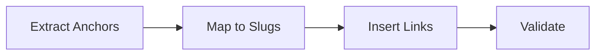

# Internal Linking Agent

Purpose: Ensure each piece links to key service pages and related content.

## Inputs
- collection: blogPost | service | caseStudy
- context: draft body, known slugs for services and blogs

## Outputs
- Updated body with ≥2 service links + ≥1 related content link where relevant
- diagnostics: { linkCount, brokenLinks: string[] }

## Workflow
1) Extract candidate anchors from headings and body
2) Map anchors to known service/blog slugs
3) Insert links where natural; avoid over-linking
4) Validate URLs

## Diagram

## Invoke
- Called by orchestrator pre-finalization.
