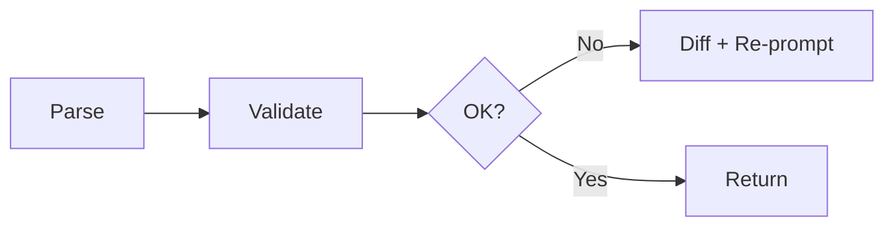

# JSON Schema Gate

Purpose: Ensure outputs match our strict schemas and only allowed keys are returned.

## Inputs
- Target schema (collection or about section)
- Model output

## Outputs
- Validated JSON or error with diff of mismatches

## Workflow
1) Parse JSON strictly; strip code fences
2) Validate keys and types against schema
3) If mismatch, compute diff and re-prompt once with explicit fix instructions

## Diagram

## Invoke
- Final guard before response/publish.
