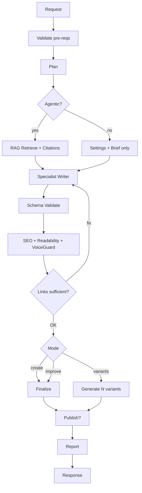
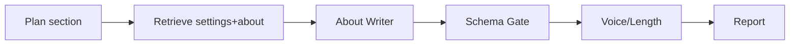

# Orchestrator (Supervisor)

Purpose: Plan → Retrieve → Write → Critique/Enforce → Merge/Publish, with strict safety and reporting.

## Contract
- Input (common):
  - collection: "blogPost" | "service" | "caseStudy" | "testimonial" | "about"
  - section?: About subsection for `about`
  - mode?: "create" | "improve" | "variants"
  - variants?: number (when mode=variants)
  - topic?: string, brief?: string
  - keywords?: string[]; packs?: { services?: boolean, caseStudies?: boolean, testimonials?: boolean, blog?: boolean, seo?: boolean }
  - agentic?: boolean; qa?: boolean
  - context?: arbitrary JSON (doc fields)
- Output:
  - result: schema-valid JSON for the collection/section
  - sources: [{ path, title, snippet? }]
  - diagnostics: { groundingScore: 0..1, readingLevel?: number, keywordScore?: number, notes?: string[] }
  - reportId?: string

## Workflow (step-by-step)
1) Validate prerequisites
   - OPENAI_API_KEY present; systemInstructions present (ai.json) [hard requirement]
   - Collection and optional section recognized; schema selected
2) Plan
   - Build userPrompt from topic/brief/keywords; gather packs selection
   - Decide retrieval query (topic + brief + keywords + collection/section)
3) Retrieve (if agentic)
   - RAG.search top‑k (k=4) with collection boosts; format citations
   - Abort or warn if zero relevant hits; continue with settings + brief
4) Write (specialist agent)
   - Call the appropriate writer (blog/service/caseStudy/about/testimonial)
   - Require `response_format=json_object` and schema guidance
5) Critique/Enforce (cross-cutting)
   - JSON schema validation (strict keys)
   - SEO checks (includeAlways present; avoid banned phrases; lengths OK)
   - Readability target Years 7–9; fix if out of bounds (1 retry)
   - Internal links: ≥2 services + 1 related content (where relevant)
   - VoiceGuard: ensure UK English + brand voice; remove fluff
6) Merge/Variants
   - mode=create: accept final
   - mode=improve: preserve meaning; shrink/expand to fit
   - mode=variants: produce N alternatives and pick a favorite (optional)
7) Publish (optional)
   - Write draft to content/ with frontmatter; or return JSON only (Tina writes)
8) Report
   - Save JSON + Markdown report with timeline, hits, scores, output preview

## Diagram

## Invocation
- Use existing route `/api/tina/ai-generate` with `agentic: true` and flags {mode, variants, qa}.
- Tina field calls stay the same; we’ll progressively add options.

---

## Domain profiles (how the Orchestrator runs each pipeline)

Below are opinionated “recipes” the Orchestrator uses per domain. They reuse the same tools but choose different writers and checks.

### About profile
- Writer: About Writer
- Retrieval: settings (ai.json, seo.json, business.json) + About page context; optional related services/testimonials
- Checks: section-specific schema; hero word targets; tone/voice guard

Workflow steps
1) Plan: understand the section goal (hero, credentials, values, body…)
2) Retrieve: pull settings + About doc context; add citations
3) Generate: call About Writer for section-only JSON
4) Enforce: schema-only keys; UK English; length bounds (e.g., hero words)
5) Report: timeline + hits + output preview

Diagram

### Blog profile
- Writer: Blog Writer
- Retrieval: settings plus relevant services/blogs; citations when quoting facts
- Checks: internal links (≥2 services + 1 related), SEO meta, readability

### Service profile
- Writer: Service Writer
- Retrieval: related services/case studies/testimonials
- Checks: bullets clarity, benefits-first, internal links, SEO meta

---

## Story mode: two concrete runs

1) About → Hero Description (Replace)
- You click “Replace” in Tina. The field sends: { collection:"about", section:"hero", agentic:true, brief, context, keywords?, mustInclude? }
- Orchestrator validates pre-reqs (api key, systemInstructions), plans the prompt, retrieves settings + About context, then calls About Writer.
- The writer returns { heroDescription } only. Orchestrator checks UK English and hero word bounds, logs timeline, saves a report, and returns JSON.
- You see the preview and citations; apply to save the field.

2) Blog → SEO Settings series post
- You run the blog profile with { collection:"blogPost", agentic:true, topic, brief, keywords }.
- It retrieves settings + related pages, drafts a Markdown body with sections, adds internal links, generates SEO meta, validates schema, and reports.
- You review the report (hits, diagnostics) and publish.

---

## Testing & debugging (end-to-end visibility)

What you’ll see
- Live timeline in server logs when `?debug=1` is set
- Persisted reports under `reports/ai` when `?report=1` is set (JSON + Markdown)

How to run
- From a client (Tina or script), call `/api/tina/ai-generate?debug=1&report=1` with the request body for your profile.

Report anatomy
- Metadata: startedAt, durationMs, model, agentic
- Timeline: ordered steps like start, retrieve.done/none, openai.request/response
- Retrieval: top‑k hits with path/title/score
- Output preview: first 600 chars (body-like fields)

Failure modes to expect
- Missing systemInstructions (ai.json) → route returns 500 (no fallback)
- OpenAI error → 502 with details and a saved report
- Empty completion / JSON parse error → 502 and report; the gate will show context

Tips
- If retrieval shows irrelevant hits, adjust the query (topic/brief/keywords) or filter boosts per profile
- Use the report ID to find both `.json` and `.md` artifacts for the same run
