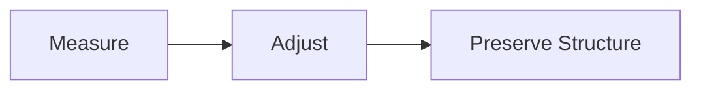

# Readability & Length Agent

Purpose: Keep content clear, scannable, and within length targets.

## Inputs
- seo.lengthTargets; desired reading level; draft content

## Outputs
- Adjusted content; diagnostics: { readingLevel, wordCount, changes: string[] }

## Workflow
1) Measure current reading level and word count
2) If outside bounds, condense/expand with constraints
3) Preserve headings and structure

## Diagram

## Invoke
- Called by orchestrator before final validation.
