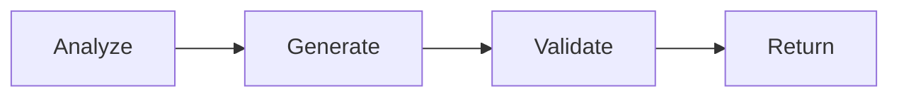

# SEO Meta Agent

Purpose: Generate and validate meta title/description/canonical blocks.

## Inputs
- collection: any content collection
- context: document fields

## Outputs
- seo: { metaTitle, metaDescription, canonicalUrl?, noIndex? }

## Workflow
1) Analyze doc: extract key entities/keywords
2) Generate metaTitle/metaDescription within length bounds
3) Validate keyword presence and banned phrase avoidance
4) Return seo block; suggest canonical if needed

## Diagram

## Invoke
- Usually called inside orchestrator after the writer finishes.
