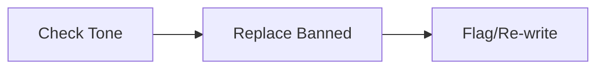

# VoiceGuard (Tone & Brand)

Purpose: Enforce brand voice, UK English, and banned phrases policy.

## Inputs
- brandVoice from ai.json; seo.keywordPolicy.avoid[]
- draft content

## Outputs
- Cleaned content; diagnostics: { replacedPhrases: string[], toneNotes?: string[] }

## Workflow
1) Check tone guidelines and region (UK English)
2) Find and replace banned phrases; suggest alternatives
3) Flag off-tone sections for rewrite (or auto-rewrite)

## Diagram

## Invoke
- Called by orchestrator after initial draft.
